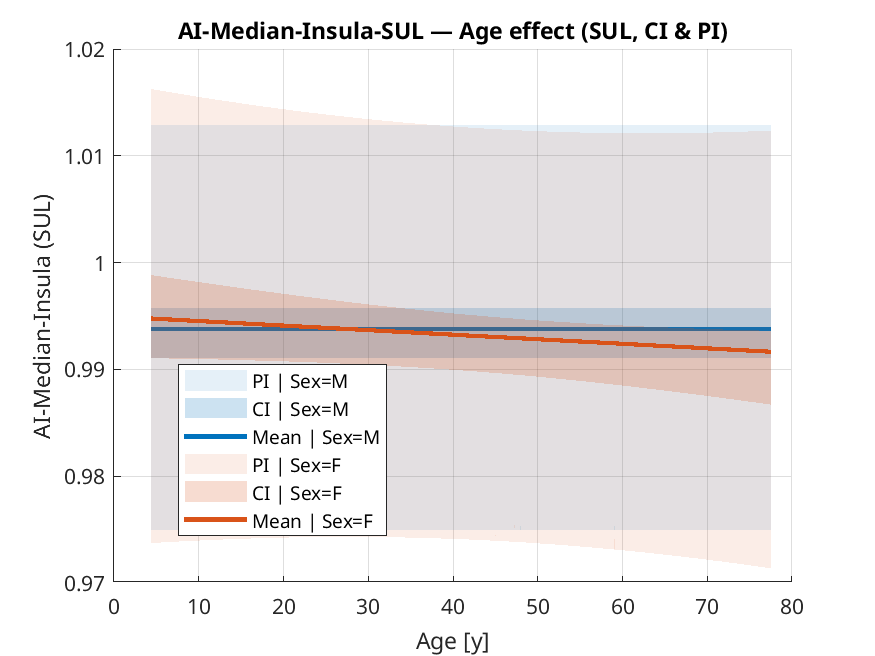
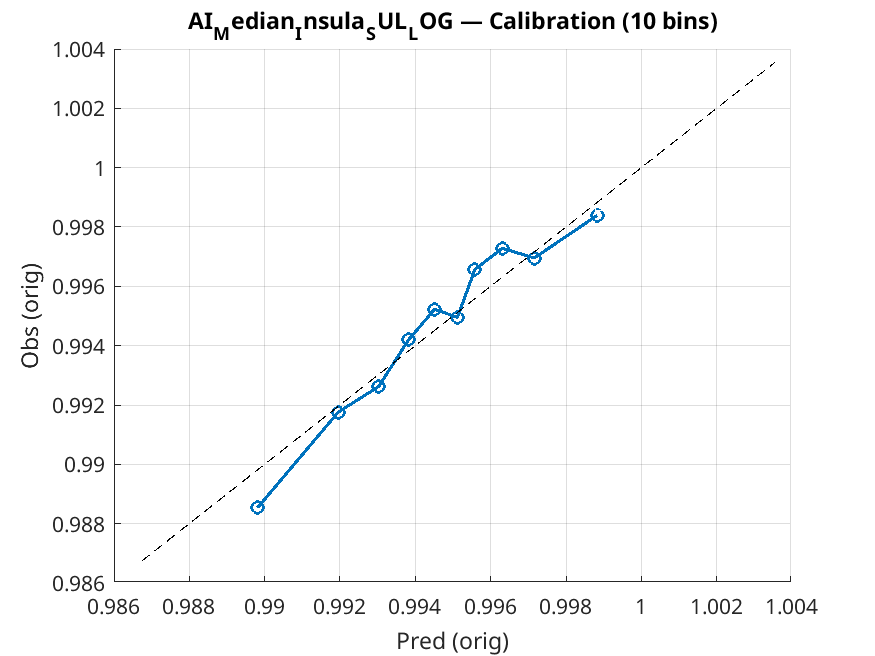
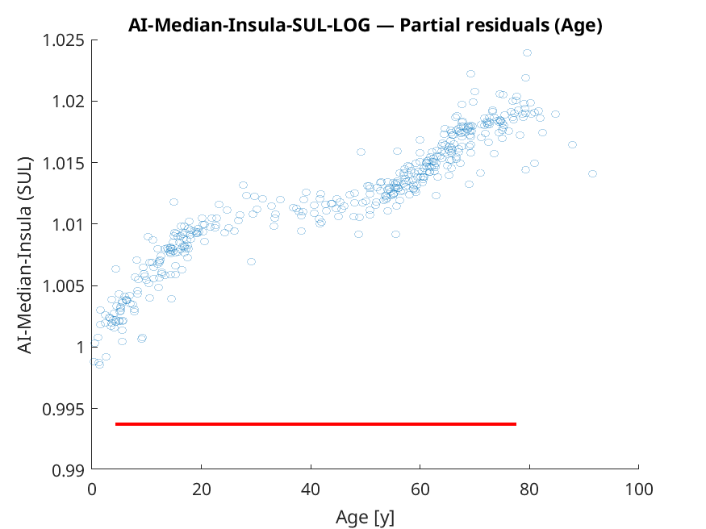
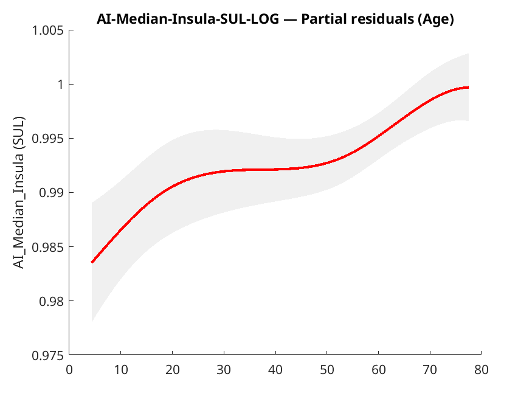
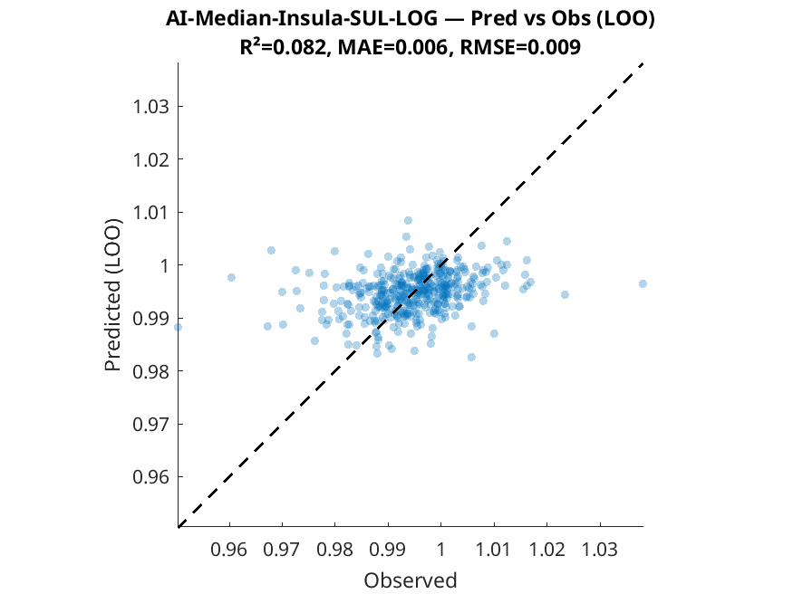
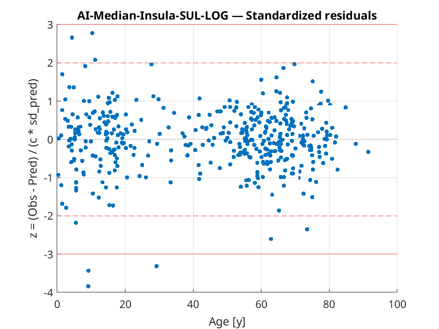
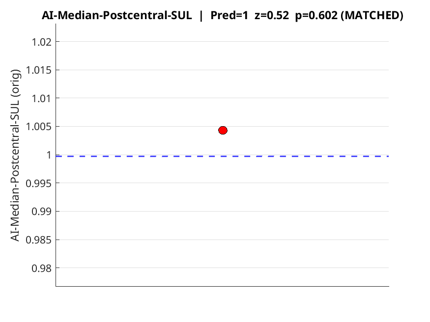
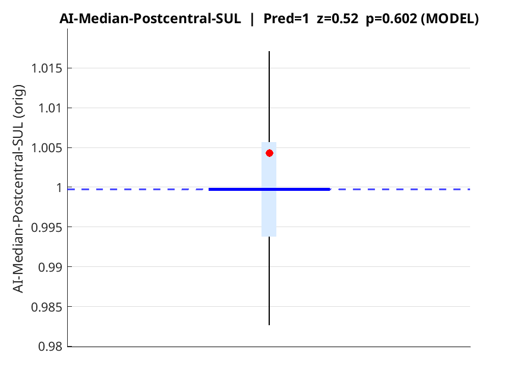

# AZV PET AI Template

**Normative modelling of FDG-PET brain asymmetry indexes (AI)**  
This branch focuses exclusively on **asymmetry indexes** (left vs right homologous regions).  
We derive asymmetry from normalized **SUL_LOG** values and fit statistical models to quantify typical patterns across age, sex, and acquisition parameters.

> ⚠️ Research prototype, not a medical device.

---

## Why asymmetry indexes?

- PET intensities can vary across scanners, patients, or global uptake.  
- Left/right asymmetry is more robust: each patient is their own control.  
- This makes deviations in focal epilepsy or neurodegeneration more detectable.  

Asymmetry Index (AI) is computed as:  
\[
AI = \frac{X_{Left} - X_{Right}}{(X_{Left} + X_{Right})/2}
\]

We apply this after SUL normalization and log-transform (`SUL_LOG`).

---

## Data processing

1. **Input data**: same cohort as before (~420 PETs).  
2. **Normalization**: affine MNI alignment, parcellation with CerebrA, thresholding < 5000 → NaN.  
3. **SUL + log transform**: values standardized per lean body mass and log-transformed.  
4. **Asymmetry computation**: for each bilateral parcel, compute AI from median SUL_LOG.  
5. **Tabulation**: build cohort-wide AI tables for modelling.

---

## Statistical model

We fit linear mixed models for each asymmetry index:

```
AgeR1 + AgeR2 + AgeR3 + AgeR4 + Sex + BMI + lTime + lDose +
logVoxelVol + logAcqDur_s + HasTOF + HasPSF + Subsets + FilterFWHM_mm +
MMI_to_MNIGMS + NCC_to_MNIGMS + Sex:cAge + lDose:lTime + (1|UNIS)
```

**Notes:**  
- `GlobalRefPC1_z` is dropped (no longer needed).  
- Age is modeled with **restricted cubic splines** (4 df).  
- Centering is applied consistently as in the previous pipeline.  
- Random intercept `(1|UNIS)` adjusts for scanner/site differences.

---

## Example region: Insula (AI of median SUL_LOG)

## What the figures show (AI example: Insula)

> All figures below use **AI-Median-Insula-SUL_LOG** (asymmetry index from median SUL_LOG).  
> For AI, values close to **1.0 ≈ symmetry**. Values **>1.0** indicate relatively higher left side, **<1.0** relatively higher right side. (This convention follows the code implementation.)

### 1) Age effect with CI & PI


**What you see**
- **X-axis:** Age [years], **Y-axis:** expected asymmetry index (AI).  
- Two solid curves = **predicted means** for males (blue) and females (orange).  
- **Narrow band (CI):** uncertainty of the **mean prediction**.  
- **Wide band (PI):** expected range for **individuals**.

**How to read**
- If AI stays close to 1.0 and curves are flat, the region is **stably symmetric** across age.  
- Use the PI for classification: a patient lying **outside the PI** at their age/sex suggests atypical asymmetry (|z| ≳ 2).

**Takeaway**
- AI has a **narrow dynamic range**. Even small deviations may be relevant if they exceed the PI.

---

### 2) Calibration (10 bins)


**What you see**
- Predictions are split into 10 equal-frequency bins. Each point compares **Predicted mean (x)** vs **Observed mean (y)**.  
- Dashed line = perfect calibration.

**How to read**
- Points on/near the diagonal → well calibrated.  
- Systematic offset or slope → need post-hoc calibration (linear or isotonic).

**Takeaway**
- Because AI values are tightly centered (≈0.99–1.01), even small biases matter. Calibration ensures z-scores and PIs are trustworthy.

---

### 3) Partial residuals (Age term)
  


**What you see**
- Dots = **partial residuals** for age (all other covariates removed).  
- Red curve = smoothed fit with 95% band.

**How to read**
- A smooth, gradual trend confirms that the **age spline** is appropriate.  
- Strong wiggles or breaks may suggest mis-specified knots or missing interactions.

**Takeaway**
- Insula AI shows only a **mild age modulation** – not dramatic, but consistent.

---

### 4) Predicted vs Observed (LOO)


**What you see**
- **Leave-One-Out (LOO)** predictions (y-axis) vs **observed** values (x-axis).  
- Dashed diagonal = ideal fit.

**How to read**
- Tight cloud around diagonal = strong generalization.  
- For AI the absolute range is very narrow (~0.99–1.01), so R² may appear lower than in absolute-intensity models – it reflects **compressed variance**, not poor modelling.

**Takeaway**
- Trust LOO plots together with calibration and PI. For AI, z-scores are more meaningful than R².

---

### 5) Standardized residuals vs Age


**What you see**
- Standardized residuals (z-scores) on y-axis vs Age.  
- Horizontal lines at ±2 (alert) and ±3 (rare/extreme).

**How to read**
- Residuals should be centered at 0 with no age trend.  
- Clusters beyond ±2 → heavier tails or unmodelled covariates.

**Takeaway**
- The same definition of z-scores is used for new-patient classification. Values beyond ±2 are flagged; ±3 are rare.

---

## Region-wise classification visuals (Postcentral AI)

### Boxplot (matched controls)


**What you see**
- Red dot = patient. Box/whiskers = **age/sex matched controls**.  
- Provides a direct distributional comparison to real cohort data.

### Boxplot (model CI/PI)


**What you see**
- Blue line = model mean.  
- Light blue band = CI.  
- Black whiskers = PI.  
- Horizontal dashed ≈ 1.0 (perfect symmetry).  
- Red dot = patient.

**How to read**
- Dot inside PI → within normal variation.  
- Dot outside PI → atypical asymmetry → high |z| in the table.

**Example JSON output**
```json
{
  "Pred_orig": 1.0033,
  "CI_orig": [0.9915, 1.0004],
  "PI_orig": [0.9839, 1.0232],
  "z": -0.93,
  "p_two_sided": 0.353,
  "is_outlier_95": false,
  "is_outlier_99": false
}
---
## Stability across regions

Based on `summary.json`:

- **High stability** (R²m > 0.8):  
  - *Middle Temporal* (0.82)  
  - *Superior Parietal* (0.81)  
  - *Inferior Parietal* (0.76)

- **Moderate stability** (0.5–0.7):  
  - *Insula* (0.64)  
  - *Lateral Orbitofrontal* (0.67)  
  - *Rostral Middle Frontal* (0.73)

- **Low stability** (< 0.3):  
  - *Basal Forebrain* (0.27)  
  - *Optic Chiasm* (0.11)  
  - *Third Ventricle* (0.19)

**Take-home**: Cortical association areas show the most reproducible asymmetry; small deep structures are noisy.

---

## Classifying a new patient (AI mode)

### Step 1: Prepare input
- Input table same as before, but including **AI columns** (computed per bilateral region).  
- Covariates centered by training cohort means.  
- PCA is not needed.

### Step 2: Predict
For each AI region, the model outputs mean prediction, CI, PI, z-score, and outlier flags.

Example JSON output (Postcentral AI):  
```json
{
  "Pred_orig": 1.0033,
  "CI_orig": [0.9915, 1.0004],
  "PI_orig": [0.9839, 1.0232],
  "z": -0.93,
  "p_two_sided": 0.353,
  "is_outlier_95": false,
  "is_outlier_99": false
}
```

### Step 3: Visualize

- **Boxplot (matched controls)**  
  

- **Boxplot (model)**  
  

---

## Summary

- AI modelling offers a **complementary perspective** to absolute uptake.  
- Variability is higher, but systematic asymmetries (e.g., temporal lobe) are well captured.  
- Classification outputs z-scores and summary plots analogous to the absolute model.  
- **Caution:** small structures yield unstable AIs; interpret only consistent cortical signals.

---

## License

MIT

---
